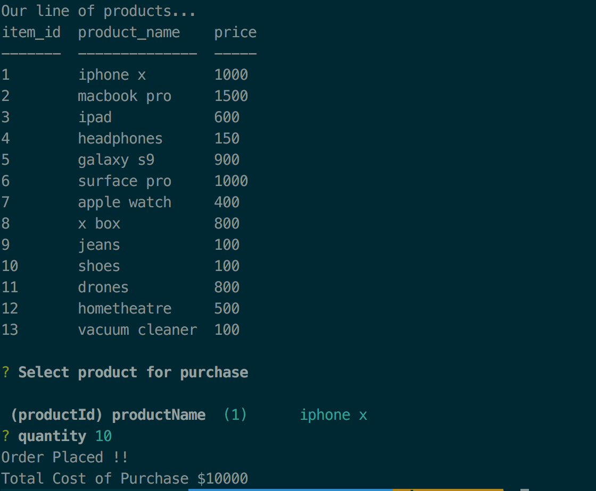
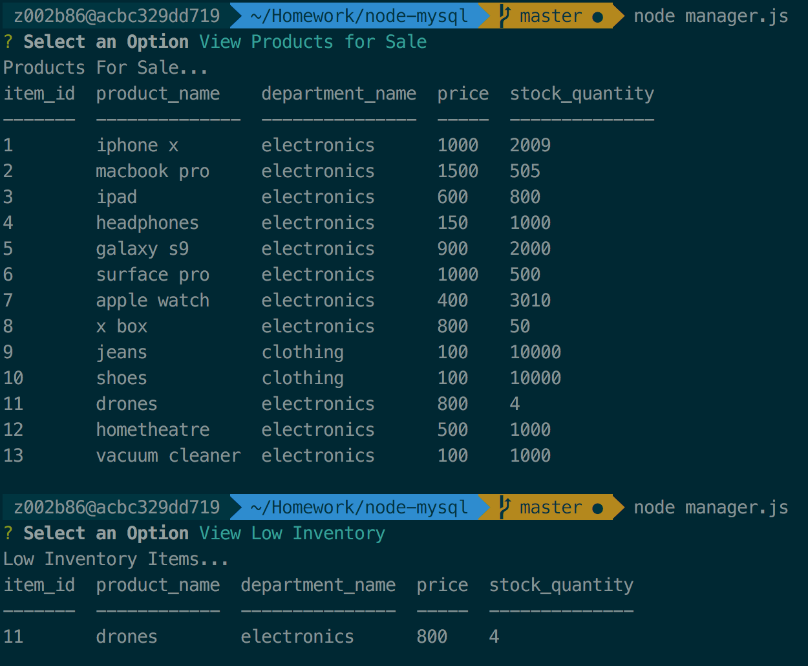
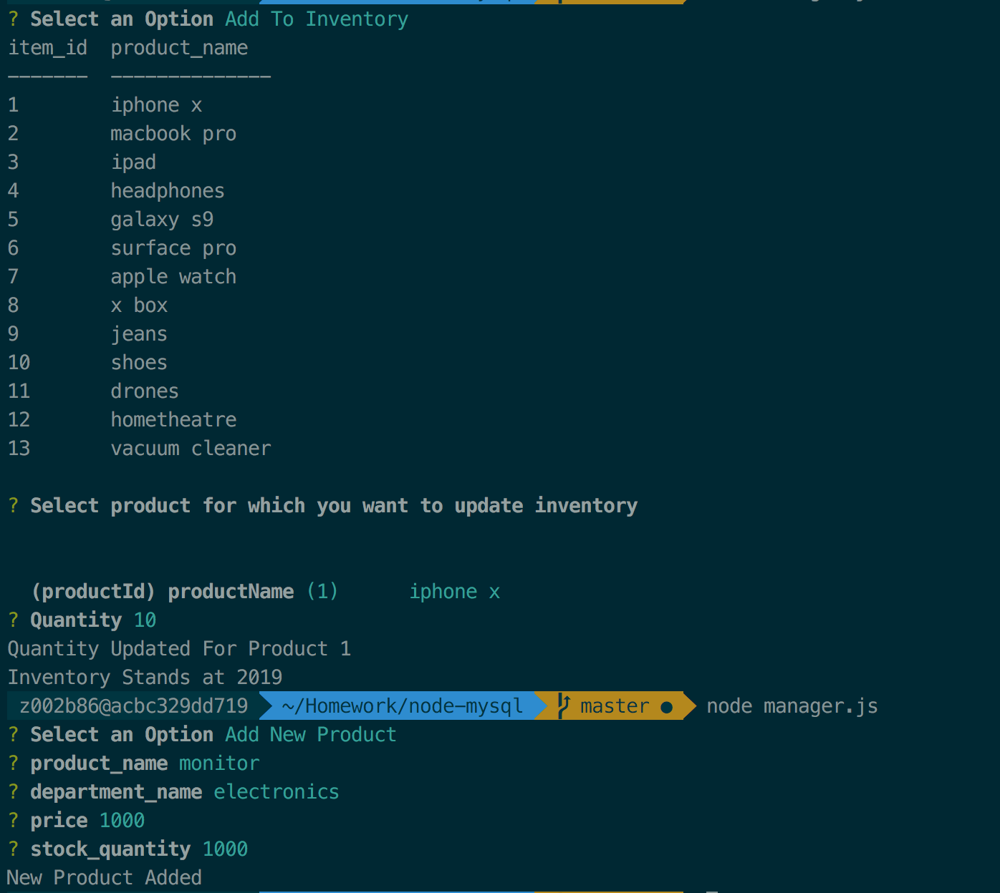

# node-mysql

An interactive shopping CLI app that uses MySQL and Node.JS that allows user to purchase items as a customer, and view, track and update product inventory as a manager.

##### Customer Portal
***

The Customer Portal allows users to view the current items available for purchase.  The user will select the item they want to buy and then how many items they wish to purchase.  If the item is in stock, the order will be completed and the user will see the total amount of their purchase.

##### Manager Portal
***

The Manager Portal allows users to view and edit the inventory of the store.  The user will be prompted to choose from the following options:
* View products for sale
* View low inventory
* Add to inventory
* Add a new product

###### Manager Options 1 & 2
***

The first option allows the user to see the list of products that are currently for sale, what department the item belongs to, the price of the product and how much stock is left for that product.

The second option allows the user to see a list of all inventory items that have less than 5 items in stock.  If there are no products that meet this criteria, the user will see an empty table.

###### Manager Options 3 & 4
***

The third option allows the user to update the inventory for a specific product.  A prompt asks the user to select the product that the user wants to update.  A second prompt asks how many items the user wishes to increase the quantity by.

The last option allows the user to add a new product to the inventory.  Prompts ask the user for the product name, the department name, the price and the stock quantity.

